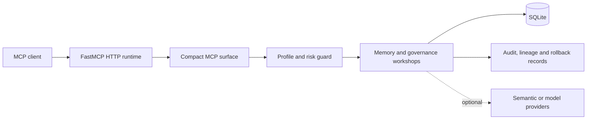

# MAPI

**Persistent project memory for Codex, ChatGPT and other MCP clients.**

MAPI helps AI assistants retain project decisions, corrections, rules, progress and next steps across sessions and tools.

Self-hosted • Local-first • Auditable • Apache 2.0

> Status: **Public Release Candidate / Developer Preview**

## Does your AI assistant forget what you worked on yesterday?

A new session can lose project decisions, corrections, completed work and next steps. MAPI provides durable project memory that MCP-compatible clients can search and update under user control. It complements client-provided chat history and memory features; it does not claim that those features do not exist.

> Chat history remembers a conversation. MAPI remembers the project.

MAPI is an independent, self-hosted memory service that can be shared by different MCP clients. The database and access boundary remain under the operator's control.

## A decision changes, but its history remains

```text
Yesterday:
Use SQLite for the application database.

Today:
Replace SQLite with PostgreSQL.

Current state:
PostgreSQL

History:
SQLite -> superseded by PostgreSQL
```

MAPI can preserve the earlier decision, mark its replacement as current, retain the lineage and keep historical context out of the active state.

## Why MAPI

- persistent project memory;
- shared memory between MCP clients;
- project-aware isolation;
- provenance and confidence metadata;
- current state with preserved history;
- decision supersession and refinement;
- conflict detection and review;
- audited preview, apply and rollback.

## Product status and boundaries

This developer preview is self-hosted. A local runtime is the supported default, and the model-free core needs no external model, API key, GPU or semantic extra. MAPI is not a hosted SaaS, a one-click extension, an LLM, an autonomous agent or a guarantee that a model will answer correctly.

ChatGPT web cannot connect directly to localhost: it requires a remote HTTPS endpoint, authentication and a safe network boundary. Docker and macOS remain unverified. SQLite has single-writer characteristics, so use one controlled writer.

## Install and run

Python 3.11 or 3.12 is required. The complete step-by-step guide is in [Installation](docs/INSTALLATION.md).

Choose the deployment that matches the client:

- **Windows local (Aurora):** MAPI and Codex/another MCP client run on the same Windows machine.
- **Linux local:** MAPI and Codex/another MCP client run on the same Linux machine.
- **Linux/VPS remote (Polaris):** MAPI runs behind HTTPS with built-in OAuth. Use this path for ChatGPT web.

Do not expose port `8015` directly to the Internet.

### Windows local quickstart

```powershell
git clone https://github.com/cabo0m/mapi-unified.git
cd mapi-unified
py -3.12 -m venv .venv
.\.venv\Scripts\python.exe -m pip install --upgrade pip
.\.venv\Scripts\python.exe -m pip install -e .
.\.venv\Scripts\mapi.exe init --mode local
.\.venv\Scripts\mapi.exe doctor
.\.venv\Scripts\mapi.exe start
```

The local MCP endpoint is `http://127.0.0.1:8015/mcp/`. Keep the server terminal open and run the protocol smoke from a second terminal:

```powershell
.\.venv\Scripts\python.exe scripts\smoke_mcp.py
```

### Linux local quickstart

```bash
git clone https://github.com/cabo0m/mapi-unified.git
cd mapi-unified
python3 -m venv .venv
source .venv/bin/activate
python -m pip install --upgrade pip
python -m pip install -e .
mapi init --mode local
mapi doctor
mapi start
```

Then, from a second terminal in the checkout:

```bash
source .venv/bin/activate
python scripts/smoke_mcp.py
```

### Linux/VPS remote quickstart

For ChatGPT web or another remote MCP client, install the same Linux checkout and initialize the built-in single-owner OAuth mode:

```bash
mapi init --mode vps-remote-auth --public-url https://mapi.example.com --service-name polaris
```

Keep MAPI on loopback, point DNS at the VPS and terminate TLS in a reverse proxy that forwards to `127.0.0.1:8015`. The initializer generates a reverse-proxy template and can install the runtime plus nightly maintenance as systemd services. See [Installation](docs/INSTALLATION.md#linuxvps-remote-installation-for-chatgpt-web) for the full sequence.

The modern CLI is `mapi init`, `mapi start`, `mapi doctor`, `mapi migrate` and `mapi recover`. Legacy direct entry points such as `mapi-init`, `mapi-server`, `mapi-doctor` and `mapi-recover` remain available for compatibility.

## Run the product demo

```bash
mapi-demo
```

Equivalent source-checkout command:

```bash
python scripts/demo_project_memory.py
```

The demo uses a temporary isolated database, no external model and the existing guarded supersession contract. It exits with an error if current state, history or the relationship is wrong. Example output:

```text
Current decision: PostgreSQL
Previous decision: SQLite
Relationship: PostgreSQL supersedes SQLite
Current record ID: 2
Previous record ID: 1
Preview hash: <sha256>
```

For a controlled lifecycle verification with a disposable database and the `maintainer`
profile, while confirming that admin remains denied, run:

```bash
python scripts/smoke_mcp_lifecycle.py
```

## Connect an MCP client

See [MCP integration](docs/MCP_INTEGRATION.md) for the full Windows/Linux and local/remote matrix.

### Windows or Linux: local Codex

Start MAPI locally, then add this Streamable HTTP server to the Codex configuration used by your installation:

```toml
[mcp_servers.mapi]
url = "http://127.0.0.1:8015/mcp/"
```

On Windows the user-level file is normally `%USERPROFILE%\.codex\config.toml`; on Linux it is `~/.codex/config.toml`.

Reload Codex, confirm the server with `codex mcp list` or `/mcp`, call `bootstrap_agent_context` for the project and search with `find_memories` before writing.

### ChatGPT web: remote Linux/VPS MAPI

ChatGPT does not directly connect to a localhost MCP server. Use a remotely reachable HTTPS MAPI endpoint initialized with `vps-remote-auth`, for example:

```text
https://mapi.example.com/mcp/
```

MAPI provides the single-owner OAuth authorization flow, PKCE, Dynamic Client Registration and refresh-token support. The reverse proxy terminates TLS and forwards to loopback only; do not add Basic Auth or expose port `8015` publicly.

OpenAI's plan and developer-mode availability can change. The current integration steps and plan limitations are maintained in [MCP integration](docs/MCP_INTEGRATION.md#linuxvps-connect-chatgpt-web-to-remote-mapi).

### Generic local MCP client

```json
{
  "mcpServers": {
    "mapi": {
      "url": "http://127.0.0.1:8015/mcp/",
      "transport": "http"
    }
  }
}
```

Client-specific field names may differ; the verified protocol contract is Streamable HTTP MCP at the configured URL.

## Recommended memory workflow

1. Call `bootstrap_agent_context` for the project.
2. Search with `find_memories` before creating another record.
3. Inspect a selected record and its links.
4. Use `save_memory` only for an explicitly authorized durable write; use `propose_memory` for uncertain agent-generated material.
5. Preview guarded lifecycle work, retain the preview hash and apply only with the required profile and approval.
6. Inspect current state, timeline and audit evidence; use rollback only under its documented guard.

## Architecture and safety



The safety pattern is `preview -> explicit apply -> audit -> rollback`. Unknown profiles fail closed to `reader`; the default is `agent`. Admin requires both the `admin` profile and `MAPI_ADMIN_TOOLS_ENABLED=true`. Optional provider output is untrusted and proposal-only.

The thin entry point is [`server.py`](server.py). Runtime composition lives in `app/runtime`, action metadata in `app/workshops`, and core operations in `app/memory` and related services. The generated action catalogue is [docs/CAPABILITIES.md](docs/CAPABILITIES.md); it is intentionally not the product introduction.

## Documentation

- [Documentation map](docs/README.md)
- [Installation](docs/INSTALLATION.md)
- [MCP integration](docs/MCP_INTEGRATION.md)
- [Configuration](docs/CONFIGURATION.md)
- [Architecture](docs/ARCHITECTURE.md)
- [Data model](docs/DATA_MODEL.md)
- [Security model](docs/SECURITY_MODEL.md)
- [Deployment](docs/DEPLOYMENT.md)
- [Comparison](docs/COMPARISON.md)
- [Known limitations](docs/KNOWN_LIMITATIONS.md)
- [Directory submission package](docs/PUBLIC_DIRECTORY_SUBMISSIONS.md)
- [Changelog](CHANGELOG.md)
- [Historical 0.1.0 RC2 notes](docs/RELEASE_NOTES_0.1.0_RC2.md)
- [Historical public release audit](docs/PUBLIC_RELEASE_AUDIT.md)

## Development and release gates

```bash
pip install -e ".[dev]"
pytest -q
ruff check .
python -m compileall -q app mapi scripts tests
mapi-capabilities
git diff --exit-code -- docs/CAPABILITIES.md
python scripts/audit_public_repository.py
git diff --check
```

## License

MAPI is licensed under the [Apache License 2.0](LICENSE). See the [licensing guide](docs/LICENSING.md).
