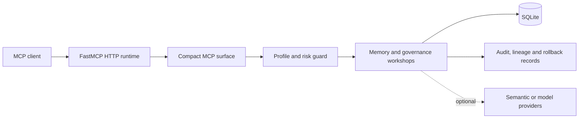

# MAPI

**Persistent project memory for Codex, ChatGPT and other MCP clients.**

MAPI helps AI assistants retain project decisions, corrections, rules, progress and next steps across sessions and tools.

Self-hosted • Local-first • Auditable • Apache 2.0

> Status: **Public Release Candidate / Developer Preview**

## Does your AI assistant forget what you worked on yesterday?

A new session can lose project decisions, corrections, completed work and next steps. MAPI provides durable project memory that MCP-compatible clients can search and update under user control. It complements client-provided chat history and memory features; it does not claim that those features do not exist.

> Chat history remembers a conversation. MAPI remembers the project.

MAPI is an independent, self-hosted memory service that can be shared by different MCP clients. The database and access boundary remain under the operator's control.

## A decision changes, but its history remains

```text
Yesterday:
Use SQLite for the application database.

Today:
Replace SQLite with PostgreSQL.

Current state:
PostgreSQL

History:
SQLite -> superseded by PostgreSQL
```

MAPI can preserve the earlier decision, mark its replacement as current, retain the lineage and keep historical context out of the active state.

## Why MAPI

- persistent project memory;
- shared memory between MCP clients;
- project-aware isolation;
- provenance and confidence metadata;
- current state with preserved history;
- decision supersession and refinement;
- conflict detection and review;
- audited preview, apply and rollback.

## Product status and boundaries

This developer preview is self-hosted. A local runtime is the supported default, and the model-free core needs no external model, API key, GPU or semantic extra. MAPI is not a hosted SaaS, a one-click extension, an LLM, an autonomous agent or a guarantee that a model will answer correctly.

ChatGPT web cannot connect directly to localhost: it requires a remote HTTPS endpoint, authentication and a safe network boundary. Docker and macOS remain unverified. SQLite has single-writer characteristics, so use one controlled writer.

## Install and run

Python 3.11 or 3.12 is required.

```bash
git clone https://github.com/cabo0m/mapi-unified.git
cd mapi-agent-memory
python -m venv .venv
```

Windows PowerShell from a source checkout:

```powershell
.venv\Scripts\Activate.ps1
python -m pip install --upgrade pip
pip install -e .
mapi init
mapi start
```

The unified Windows release bundle can instead be installed with `install-windows.ps1`. It creates a private venv under `%LOCALAPPDATA%\MAPI`, uses the same `~/.mapi-agent-memory` instance layout as Linux, registers safe nightly maintenance through Windows Task Scheduler, and preserves instance data during a normal uninstall. The legacy `mapi-init`, `mapi-server`, `mapi-doctor` and other direct entry points remain supported for scripts and compatibility.

Linux:

```bash
source .venv/bin/activate
python -m pip install --upgrade pip
pip install -e .
mapi-init
mapi-server
```

`mapi-init` is the canonical first-run bootstrap. By default it creates a private instance under `~/.mapi-agent-memory`, writes a protected `.env`, creates the SQLite database and directories, applies all migrations, creates and verifies the first SQLite backup, runs final doctor checks and emits a fingerprinted init manifest. Local mode may seed the explicitly configured Agent Self Model identity. `vps-remote-auth` seeds only the self-namespace guardrail: the human-facing assistant name is deliberately left unset until the user chooses it during first-run Polaris onboarding. The initializer does **not** seed the product demo and does not perform privileged system changes unless service installation is explicitly accepted/requested.

For a VPS, run the wizard and choose `vps-proxy` or `vps-remote-auth`, or use flags such as:

```bash
mapi-init --mode vps-proxy --public-url https://mapi.example.com --service-name polaris
```

The VPS modes keep MAPI bound to `127.0.0.1` and generate the runtime systemd unit, a paired nightly memory-maintenance service/timer, and a reverse-proxy security template. In `vps-remote-auth`, first-run also configures the single built-in owner login used by the OAuth authorization flow. After the first ChatGPT connection, Polaris exposes a guided onboarding one question at a time: the user names the assistant, provides their preferred name and work context, chooses how proactive the assistant should be and how memory should behave, optionally defines memory exclusions, and may create a first project. Answers remain draft onboarding state until a final summary is reviewed and confirmed; corrections can be applied before the profile is committed to durable memory. `--service-name` selects an isolated systemd unit such as `polaris.service` and corresponding `polaris-maintenance.service` / `polaris-maintenance.timer`. On an interactive Linux VPS, `mapi-init` offers to install and start the generated services immediately; in automation use `--install-service` explicitly. The maintenance timer runs locally on the customer's VPS and does not require vendor credentials or later SSH access. It creates verified SQLite backups before mutation, automatically applies only deterministic metadata and unambiguous structural repairs, never deletes memory content, and queues semantically ambiguous lineage repairs for the connected assistant model. If the model cannot safely resolve the ambiguity without changing meaning, Polaris asks the user for concise consent and preserves the losing version as history. Healthy maintenance runs remain invisible to the user. The installer waits for the local listener, probes the endpoint, and only then runs the final doctor report so the result describes the finished installation. `mapi-init --resume` reuses the verified first backup and refuses identity/runtime reconfiguration.

At the end, the installer prints the exact connection address, for example:

```text
MAPI MCP address: https://mapi.example.com/mcp/
Local loopback: http://127.0.0.1:8015/mcp/
Endpoint status: public_endpoint_reachable
```

The same address is printed every time `mapi-server` starts. If the authenticated TLS reverse proxy is not ready yet, the address is still reported but the status remains `configured` or `local_listener_ready` instead of claiming public reachability.

Operational commands load the generated instance automatically from the default root. For a custom root, pass the same path explicitly, for example `mapi-doctor --root <instance-root>`, `mapi-server --root <instance-root>` or `mapi-recover --root <instance-root>`. `mapi-doctor` is the canonical health report; `mapi-recover` is preview-first unless `--execute` is explicitly requested.

The verified local endpoint is:

```text
http://127.0.0.1:8015/mcp/
```

The first-run bootstrap performs no external model calls and downloads no model. After starting MAPI, verify the protocol from the source checkout:

```bash
python scripts/smoke_mcp.py
```

The smoke uses the safe `agent` profile, writes a fictional record, searches and reads it, checks links and timeline access, and confirms that admin is denied.

Agent Self Model includes deterministic snapshot deltas and a controlled source-bound self narrative. Optional Gemini planning can select only known claim IDs; it cannot write the narrative or invent source IDs.

## Run the product demo

```bash
mapi-demo
```

Equivalent source-checkout command:

```bash
python scripts/demo_project_memory.py
```

The demo uses a temporary isolated database, no external model and the existing guarded supersession contract. It exits with an error if current state, history or the relationship is wrong. Example output:

```text
Current decision: PostgreSQL
Previous decision: SQLite
Relationship: PostgreSQL supersedes SQLite
Current record ID: 2
Previous record ID: 1
Preview hash: <sha256>
```

For a controlled lifecycle verification with a disposable database and the `maintainer`
profile, while confirming that admin remains denied, run:

```bash
python scripts/smoke_mcp_lifecycle.py
```

## Connect an MCP client

### Codex

Start MAPI, then add this Streamable HTTP server to `~/.codex/config.toml` or a
trusted project's `.codex/config.toml`:

```toml
[mcp_servers.mapi]
url = "http://127.0.0.1:8015/mcp/"
```

Reload Codex, confirm the server with `codex mcp list` or `/mcp`, call
`bootstrap_agent_context` for the project and search with `find_memories` before
writing. See the [verified integration sequence](docs/MCP_INTEGRATION.md#codex).

### ChatGPT desktop

Current ChatGPT desktop builds with MCP server settings can add a Streamable HTTP URL
under **Settings -> MCP servers** and require a restart after saving. Availability can
still depend on the distributed application version and workspace controls; support is
not promised for every plan or managed workspace.

### ChatGPT web

The web application cannot reach `127.0.0.1` on your computer. Use `mapi-init --mode vps-remote-auth` for the supported single-owner remote deployment. Polaris/MAPI acts as the OAuth authorization server, exposes Dynamic Client Registration for ChatGPT, shows the owner login directly at `/authorize`, and maps that one authenticated owner to the `admin` profile and full workshop surface. In the normal ChatGPT path the customer supplies only the MCP URL and their Polaris login; Client ID and callback are registered automatically. On a fresh instance, the first bootstrap then starts guided onboarding and lets the customer choose the assistant's personal name; Polaris remains the product/runtime name. The reverse proxy terminates TLS and forwards traffic only; do not add Basic Auth or a second identity gateway. Use `vps-proxy` only when an external authenticated proxy is deliberately supplying the security boundary instead of built-in OAuth.

### Generic MCP client

```json
{
  "mcpServers": {
    "mapi": {
      "url": "http://127.0.0.1:8015/mcp/",
      "transport": "http"
    }
  }
}
```

The endpoint and HTTP MCP transport are covered by the protocol smoke. Client-specific configuration keys may differ.

## Recommended memory workflow

1. Call `bootstrap_agent_context` for the project.
2. Search with `find_memories` before creating another record.
3. Inspect a selected record and its links.
4. Use `save_memory` only for an explicitly authorized durable write; use `propose_memory` for uncertain agent-generated material.
5. Preview guarded lifecycle work, retain the preview hash and apply only with the required profile and approval.
6. Inspect current state, timeline and audit evidence; use rollback only under its documented guard.

## Architecture and safety



The safety pattern is `preview -> explicit apply -> audit -> rollback`. Unknown profiles fail closed to `reader`; the default is `agent`. Admin requires both the `admin` profile and `MAPI_ADMIN_TOOLS_ENABLED=true`. Optional provider output is untrusted and proposal-only.

The thin entry point is [`server.py`](server.py). Runtime composition lives in `app/runtime`, action metadata in `app/workshops`, and core operations in `app/memory` and related services. The generated action catalogue is [docs/CAPABILITIES.md](docs/CAPABILITIES.md); it is intentionally not the product introduction.

## Documentation

- [Documentation map](docs/README.md)
- [Installation](docs/INSTALLATION.md)
- [MCP integration](docs/MCP_INTEGRATION.md)
- [Configuration](docs/CONFIGURATION.md)
- [Architecture](docs/ARCHITECTURE.md)
- [Data model](docs/DATA_MODEL.md)
- [Security model](docs/SECURITY_MODEL.md)
- [Deployment](docs/DEPLOYMENT.md)
- [Comparison](docs/COMPARISON.md)
- [Known limitations](docs/KNOWN_LIMITATIONS.md)
- [Directory submission package](docs/PUBLIC_DIRECTORY_SUBMISSIONS.md)
- [RC2 draft release notes](docs/RELEASE_NOTES_0.1.0_RC2.md)
- [Public release audit](docs/PUBLIC_RELEASE_AUDIT.md)

## Development and release gates

```bash
pip install -e ".[dev]"
pytest -q
ruff check .
python -m compileall -q app mapi scripts tests
mapi-capabilities
git diff --exit-code -- docs/CAPABILITIES.md
python scripts/audit_public_repository.py
git diff --check
```

## License

MAPI is licensed under the [Apache License 2.0](LICENSE). See the [licensing guide](docs/LICENSING.md).
